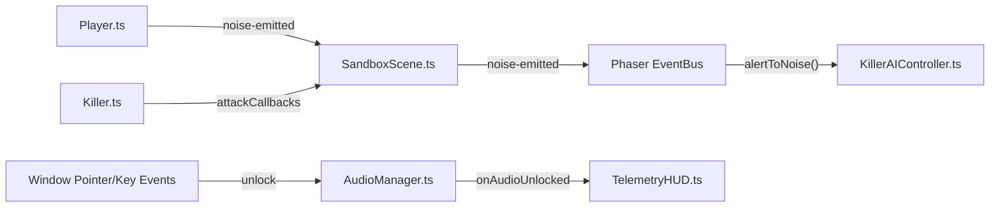

# Auditoria Estrutural e Mapa de Arquitetura Pré-Refactor (Codebase Inventory)

**Data da Auditoria:** 2026-10-07  
**Escopo:** Diretório `src/` (TypeScript / Phaser 3)  
**Status do Repositório:** 100% dos testes unitários passando (232 testes), build verde (`tsc && vite build`).  
**Objetivo:** Mapear metricamente linhas de código, assinaturas públicas, eventos e teia de acoplamento para embasar a refatoração modular.

---

## 1. Árvore de Ficheiros e Métricas de Linhas

A base de código em `src/` totaliza **10.022 linhas de código** distribuídas em **17 ficheiros `.ts`**.

### 1.1 Tabela Geral Ordenada por Contagem de Linhas

| Caminho do Ficheiro | Linhas | Categoria Arquitetural | Status de Linhas |
| :--- | :---: | :--- | :---: |
| `src/utils/gameLogic.ts` | **2.205** | Utilitários, Matemática e Lógica Compartilhada | 🚨 **Crítico** (> 300) |
| `src/audio/AudioManager.ts` | **1.315** | Motor de Áudio Procedural (Web Audio API) | 🚨 **Crítico** (> 300) |
| `src/scenes/SandboxScene.ts` | **917** | Cena Principal e Orquestrador Phaser | 🚨 **Crítico** (> 300) |
| `src/entities/Killer.ts` | **844** | Entidade Física, Atuadores e Combate do Killer | 🚨 **Crítico** (> 300) |
| `src/controllers/KillerAIController.ts` | **801** | Máquina de Estados e Pathfinding da IA | 🚨 **Crítico** (> 300) |
| `src/ui/DebugPanel.ts` | **686** | Painel de Controle e Sliders (lil-gui) | 🚨 **Crítico** (> 300) |
| `src/entities/Player.ts` | **567** | Entidade do Sobrevivente (Survivor) | 🚨 **Crítico** (> 300) |
| `src/map/MapBuilder.ts` | **503** | Geração e Definição da Malha de Salas/Paredes | 🚨 **Crítico** (> 300) |
| `src/ui/TelemetryHUD.ts` | **487** | HUD HTML/DOM e Feedback Visual de Terror | 🚨 **Crítico** (> 300) |
| `src/entities/Generator.ts` | **456** | Entidade de Geradores e Feedback Visual | 🚨 **Crítico** (> 300) |
| `src/editor/GeneratorPlacer.ts` | **394** | Editor de Posicionamento e Spawns | 🚨 **Crítico** (> 300) |
| `src/systems/SkillCheckSystem.ts` | **379** | Sistema de QTE / Agulha Radial de Reparo | 🚨 **Crítico** (> 300) |
| `src/config/constants.ts` | **155** | Constantes Globais e Configurações Padrão | ✅ Adequado (< 250) |
| `src/systems/SoundFX.ts` | **137** | Wrapper Legado de Efeitos Sonoros | ✅ Adequado (< 250) |
| `src/ui/RepairPromptUI.ts` | **116** | Balão de Prompt de Interação [E] | ✅ Adequado (< 250) |
| `src/controllers/KillerController.ts` | **30** | Interface de Desacoplamento do Controlador | ✅ Adequado (< 250) |
| `src/main.ts` | **30** | Ponto de Entrada e Configuração Phaser.Game | ✅ Adequado (< 250) |
| **TOTAL** | **10.022** | **17 ficheiros** | **12 candidatos a refactor** |

---

### 1.2 Destaque Explícito: Ficheiros com Limiar Ultrapassado (> 250-300 Linhas)

Doze (12) dos dezessete (17) ficheiros ultrapassam a marca recomendada de 250-300 linhas, sendo candidatos prioritários à decomposição:

1. 🚨 **`src/utils/gameLogic.ts` (2.205 linhas — 22% de todo o codebase):**
   * *Diagnóstico:* Atua como um *God File*. Reúne sob o mesmo módulo: conversões métricas, colisão de corpos rígidos, raycasting em grade, persistência em LocalStorage, interpolação de curvas de IA, regras de combate M1 e serialização de candidatos.
   * *Recomendação:* Decomposição em submódulos de domínio (`src/physics/collision.ts`, `src/navigation/raycast.ts`, `src/storage/generatorStorage.ts`, `src/combat/hitDetection.ts`).

2. 🚨 **`src/audio/AudioManager.ts` (1.315 linhas):**
   * *Diagnóstico:* Centraliza toda a síntese Web Audio API sem separação de responsabilidades (passos de survivor, passos de killer, zumbido de motor, explosão, batimentos cardíacos com harmônicos, drone dissonante, chute e estalos estocásticos).
   * *Recomendação:* Extrair geradores de som para sintetizadores especializados (`FootstepSynthesizer`, `TerrorRadiusSynthesizer`, `GeneratorAudioSynthesizer`).

3. 🚨 **`src/scenes/SandboxScene.ts` (917 linhas):**
   * *Diagnóstico:* Acumula manipulação direta de inputs (mouse, drag, teclado), listeners globais de window, orquestração de áudio, tweens de ondas acústicas e regras de interação de geradores.
   * *Recomendação:* Extrair gerenciamento de câmera/pan e despachante de eventos de áudio/input.

4. 🚨 **`src/entities/Killer.ts` (844 linhas):**
   * *Diagnóstico:* Mistura o corpo físico do assassino com a lógica de corte M1, renderização de gráficos de debug (visão, cone e rota A*), e colisão com paredes.
   * *Recomendação:* Delegar renderização gráfica de debug e ciclo de combate M1 para subsistemas desacoplados.

5. 🚨 **`src/controllers/KillerAIController.ts` (801 linhas):**
   * *Diagnóstico:* Mistura máquina de estados finitos (FSM), patrulha de geradores, watchdog anti-stuck, raycasting de linha de visão direta e pathfinding EasyStar.
   * *Recomendação:* Separar a FSM dos algoritmos de navegação e inspeção.

6. 🚨 **`src/ui/DebugPanel.ts` (686 linhas):**
   * *Diagnóstico:* Criação verbosa de pastas e bindings do lil-gui, tooltips e listeners de sincronização.
   * *Recomendação:* Separar a declaração de schemas de pastas do código de controle de eventos.

7. 🚨 **`src/entities/Player.ts` (567 linhas):**
   * *Diagnóstico:* Acumula física de movimento, rotação ao cursor, emissão de ruído acústico e contenção em paredes.

8. 🚨 **`src/map/MapBuilder.ts` (503 linhas):**
   * *Diagnóstico:* Matrizes literais do mapa orgânico e geração procedural de ladrilhos mescladas em arquivo único.

9. 🚨 **`src/ui/TelemetryHUD.ts` (487 linhas):**
   * *Diagnóstico:* Cache de elementos DOM, animações de batimento cardíaco Phaser e gerenciamento do card de legenda HTML.

10. 🚨 **`src/entities/Generator.ts` (456 linhas):**
    * *Diagnóstico:* Gerenciamento de containers visuais, barras de progresso, áudio e colisão sólida.

11. 🚨 **`src/editor/GeneratorPlacer.ts` (394 linhas):**
    * *Diagnóstico:* Editor de posicionamento de candidatos de spawn e manipulação de grade.

12. 🚨 **`src/systems/SkillCheckSystem.ts` (379 linhas):**
    * *Diagnóstico:* Renderização gráfica de agulha e cálculo trigonométrico de sucesso/falha de QTE.

---

## 2. Mapa de Interfaces e Assinaturas Públicas

Abaixo estão detalhadas as assinaturas públicas das classes principais em `src/audio`, `src/entities`, `src/scenes` e `src/controllers`.

### 2.1 `src/audio/AudioManager.ts` (Singleton)

| Método Público | Assinatura | Descrição |
| :--- | :--- | :--- |
| `getInstance` | `(): AudioManager` | Retorna a instância única singleton |
| `onAudioUnlocked` | `(cb: () => void): () => void` | Registra callback disparado quando o AudioContext sai de suspended |
| `isContextRunning` | `(): boolean` | Informa se o AudioContext está ativo (`state === 'running'`) |
| `getContext` | `(): AudioContext \| null` | Obtém ou instancia defensivamente o contexto Web Audio |
| `ensureContextRunning` | `(): Promise<void>` | Tenta invocar `resume()` de forma idempotente e notifica callbacks |
| `resumeContext` | `(): void` | Força a retomada do contexto suspenso |
| `setEnabled` / `isEnabled` | `(enabled: boolean): void` / `(): boolean` | Liga/desliga todos os efeitos sonoros |
| `setMasterVolume` / `getMasterVolume` | `(vol: number): void` / `(): number` | Modula ganho geral entre 0.0 e 1.0 |
| `playSurvivorFootstep` | `(isRunning?: boolean): void` | Sintetiza pulso de passo do sobrevivente filtrado em banda |
| `playKillerFootstep` | `(volumeScale?: number): void` | Sintetiza impacto ressonante e sub-grave do assassino |
| `startGeneratorRepairSound` | `(): void` | Inicia som contínuo com LFO modulador de ferramenta no gerador |
| `stopGeneratorRepairSound` | `(): void` | Encerra o áudio contínuo de reparo |
| `playGeneratorExplosion` | `(): void` | Sintetiza estrondo de explosão com queda exponencial |
| `updateTerrorRadius` | `(dist: number, state?: string\|boolean\|number, delta?: number): void` | Atualiza batimentos (Camada 1) e drone (Camada 2) |
| `stopTerrorRadius` | `(): void` | Silencia batimentos e interrompe o drone |
| `playGeneratorKickSound` | `(): void` | Sintetiza impacto metálico de chute no gerador |
| `startDamagedMotorLoop` | `(): void` | Inicia loop de motor engasgando a 58Hz com LFO de 8.5Hz |
| `stopDamagedMotorLoop` | `(): void` | Encerra o loop de motor danificado |
| `startGeneratorSparkingSound` | `(genId: string): void` | Registra gerador regredindo e inicia estalos |
| `stopGeneratorSparkingSound` | `(genId: string): void` | Remove gerador da regressão |
| `stopAllSparkingSounds` | `(): void` | Encerra todo o ruído de motor danificado e faíscas |
| `updateDamagedGeneratorAudio` | `(xOrDist: number, y?: number, gx?: number, gy?: number): number` | Aplica atenuação espacial de distância (10m = 600px cutoff) |
| `playStochasticSpark` | `(): void` | Sintetiza estalo agudo passa-alta de faísca elétrica |
| `playAttackSwingSound` | `(): void` | Sintetiza whoosh de lâmina no ar |
| `playAttackHitSound` | `(): void` | Sintetiza impacto carnoso e corte ao acertar Survivor |

---

### 2.2 `src/entities/Killer.ts` (Implementa `IKillerPawn`)

| Propriedade / Método Público | Assinatura | Descrição |
| :--- | :--- | :--- |
| `sprite` | `Phaser.Physics.Arcade.Sprite` | Corpo físico e renderização do Killer |
| `controller` | `IKillerController` | Controlador de IA associado |
| `isAttacking` | `boolean` | Flag de execução de ataque M1 |
| `attackState` | `KillerAttackState` | `'IDLE' \| 'WINDUP' \| 'LUNGE' \| 'SUCCESS_RECOVERY' \| 'MISS_RECOVERY'` |
| `attackTimer` | `number` | Temporizador milissegundos da fase de combate atual |
| `targetSurvivor` | `Player \| undefined` | Alvo atual do ataque |
| `setController` | `(controller: IKillerController): void` | Injeta o controlador de IA |
| `update` | `(delta: number, player: Player, gens: Generator[], settings: DebugSettings): void` | Loop principal de atualização |
| `alertToNoise` | `(x: number, y: number, targetGen?: any): void` | Alerta o assassino para ruído acústico emitido |
| `setVelocity` | `(vx: number, vy: number): void` | Define vetor de velocidade física Arcade |
| `stopMovement` | `(): void` | Zera velocidade física |
| `rotateTowards` | `(targetAngle: number, delta: number, turnSpeed: number): void` | Rotação angular suave com menor arco |
| `performAttack` | `(targetPlayer?: Player): boolean` | Inicia o Lunge Dash de 250ms |
| `updateAttack` | `(delta: number, player?: Player, settings?: DebugSettings): void` | Atualiza temporizadores e transições de M1 |
| `onAttackHit` | `(survivor?: Player): void` | Aplica dano, som e entra em Success Recovery (2.7s) |
| `onAttackMiss` | `(): void` | Entra em Miss Recovery (1.5s) |
| `checkSlashHit` | `(player: Player, settings?: DebugSettings): boolean` | Avalia arco de 140° e alcance de 1.9m |
| `handlePlayerCollision` | `(player: Player, settings: DebugSettings, onAttack?: () => void): void` | Trata colisão sólida e dano de contato |
| `hasLineOfSight` | `(x1: number, y1: number, x2: number, y2: number, clearance?: number): boolean` | Traçado de raio livre de paredes |
| `calculatePath` | `(x1: number, y1: number, x2: number, y2: number, cb: (path: any) => void): void` | Invoca pathfinding A* no EasyStar |
| `renderVisionGraphic` | `(settings: DebugSettings, target: any, isChase: boolean): void` | Renderiza cone e círculos de visão de debug |
| `renderRouteGraphic` | `(path: Array<{x: number, y: number}>, targetPos?: any): void` | Renderiza linha tracejada da rota A* |

---

### 2.3 `src/entities/Player.ts` (Sobrevivente)

| Propriedade / Método Público | Assinatura | Descrição |
| :--- | :--- | :--- |
| `sprite` | `Phaser.Physics.Arcade.Sprite` | Sprite físico com física Arcade |
| `isActive` | `boolean` | Flag de ativação (controlável vs espectador) |
| `isMoving` / `isSprinting` | `boolean` | Estados de locomoção atuais |
| `currentSpeed` | `number` | Velocidade escalar real do frame |
| `isInjured` | `boolean` | Estado de saúde (ferido vs saudável) |
| `noiseRadius` | `number` | Raio acústico de ruído emitido (0m, 4.0m ou 14.0m) |
| `update` | `(delta: number, isRepairing: boolean, settings: DebugSettings): void` | Entrada WASD, sprint e rotação ao mouse |
| `enforceWallBounds` | `(navGrid: number[][]): void` | Bloqueio rígido contra ladrilhos de parede |
| `emitNoise` | `(radiusInMeters: number): void` | Dispara o evento de ruído `'noise-emitted'` |
| `takeDamage` | `(): void` | Transiciona para estado de ferido |
| `heal` | `(): void` | Restaura estado saudável |

---

### 2.4 `src/entities/Generator.ts`

| Propriedade / Método Público | Assinatura | Descrição |
| :--- | :--- | :--- |
| `id` / `name` / `roomName` | `string` | Identificação e nome da sala |
| `progress` | `number` | Progresso atual (0 a 100%) |
| `isCompleted` / `isRegressing` | `boolean` | Estados do gerador |
| `regressRate` | `number` | Taxa de regressão (`0.25%/s`) |
| `addProgress` | `(amount: number): boolean` | Incrementa progresso com clamp a 100% |
| `complete` | `(): void` | Marca como concluído (luz verde) |
| `kickGenerator` | `(): void` | Aplica chute do Killer, inicia faíscas e som |
| `stopRegression` | `(): void` | Cancela regressão quando Survivor repara |
| `onRepairTick` | `(deltaMs: number): boolean` | Executa reparo progressivo por frame |
| `explode` | `(): void` | Aplica penalidade (-10%) e emite faíscas |
| `update` | `(delta: number): void` | Atualiza regressão e animação de faíscas |

---

### 2.5 `src/controllers/KillerAIController.ts` (Implementa `IKillerController`)

| Propriedade / Método Público | Assinatura | Descrição |
| :--- | :--- | :--- |
| `state` | `AIState` | `'PATROL' \| 'INSPECTING' \| 'CHASE' \| 'DESATIVADO' \| 'STANDBY' \| 'INVESTIGATING_SOUND'` |
| `patrolTarget` | `Vector2D` | Coordenada do alvo de patrulha atual |
| `update` | `(delta: number, player: Player, gens: Generator[], settings: DebugSettings): void` | Avalia LOS, perseguição e patrulha |
| `advanceToNextPatrolGenerator` | `(generators: Generator[]): void` | Seleciona o próximo gerador no gestor de patrulha |
| `investigateSound` | `(x: number, y: number): void` | Desvia rota para inspecionar ruído acústico |
| `alertToNoise` | `(x: number, y: number, targetGen?: any): void` | Recebe estímulo sonoro e transiciona FSM |
| `handleWatchdogAntiStuck` | `(delta: number, generators: Generator[]): void` | Recupera Killer caso velocidade física estagne |

---

### 2.6 `src/scenes/SandboxScene.ts`

| Método Público | Assinatura | Descrição |
| :--- | :--- | :--- |
| `spawnSoundWave` | `(x: number, y: number, radiusM: number, color?: number, duration?: number): void` | Cria onda acústica expansiva (ripple) |
| `refreshNavGridAndEasyStar` | `(): void` | Reconstrói malha de navegação com geradores ativos |
| `instantiateGeneratorsFromCandidates`| `(candidates: any[], clearOld?: boolean): void` | Instancia geradores a partir de lista de spawns |
| `spawnRandomGenerators` | `(count?: number): void` | Sorteia geradores respeitando dispersão |
| `clearAllGenerators` | `(notify?: boolean, clearStorage?: boolean): void` | Remove todos os geradores ativos |
| `persistActiveGenerators` | `(): void` | Salva geradores no LocalStorage (resistência a F5) |

---

## 3. Catálogo de Eventos Emitidos e Escutados

1. **`'noise-emitted'` (Evento Customizado de Phaser):**
   * *Emissor:* `src/scenes/SandboxScene.ts` e `src/entities/Player.ts`.
   * *Payload:* `{ x: number, y: number, radiusInMeters: number, source: 'survivor' | 'killer' | 'generator' }`.
   * *Consumidores:* Cria animação de ripple (`spawnSoundWave`) e alerta o Killer (`killer.alertToNoise`).

2. **`Phaser.Scenes.Events.POST_UPDATE`:**
   * *Escutado em:* `src/scenes/SandboxScene.ts`.
   * *Ação:* Executa `player.postUpdate` e `killer.postUpdate` após a etapa de física para imposição de colisão sólida estática.

3. **Eventos Nativos do DOM e Window:**
   * `['pointerdown', 'keydown', 'mousedown', 'touchstart', 'click']`: Escutados em `AudioManager.ts` para desbloqueio do `AudioContext`.
   * `'keydown'`: Escutado em `SandboxScene.ts` para interceptar atalhos globais (<kbd>Espaço</kbd>, <kbd>E</kbd>).

---

## 4. Dependências e Acoplamento ("Quem Consome Quem")

### 4.1 Tabela de Consumo e Dependências

| Módulo / Ficheiro | Consome (Depende de) | É Consumido Por (Chamado por) | Nível de Acoplamento |
| :--- | :--- | :--- | :---: |
| `src/utils/gameLogic.ts` | Nenhum (apenas tipos básicos) | Quase todos os módulos do projeto | ⚠️ **Altíssimo (Central)** |
| `src/audio/AudioManager.ts` | `constants.ts`, `gameLogic.ts` | `SandboxScene.ts`, `Killer.ts`, `Generator.ts` | ⚠️ **Alto** |
| `src/entities/Killer.ts` | `KillerAIController.ts`, `AudioManager.ts`, `gameLogic.ts` | `SandboxScene.ts`, `KillerAIController.ts` | ⚠️ **Alto (Bidirecional)** |
| `src/controllers/KillerAIController.ts`| `IKillerPawn` (`Killer.ts`), `gameLogic.ts` | `Killer.ts` | ⚠️ **Alto (Circular/Pawn)** |
| `src/entities/Player.ts` | `gameLogic.ts`, `constants.ts` | `SandboxScene.ts`, `Killer.ts`, `KillerAIController.ts` | 🟡 Médio |
| `src/entities/Generator.ts` | `AudioManager.ts`, `gameLogic.ts`, `constants.ts` | `SandboxScene.ts`, `KillerAIController.ts` | 🟡 Médio |
| `src/scenes/SandboxScene.ts` | Todas as entidades, HUD, áudio, placer e sistemas | Ponto de entrada (`main.ts`) | ⚠️ **Alto (Orquestrador)** |
| `src/ui/TelemetryHUD.ts` | `AudioManager.ts`, `constants.ts`, `gameLogic.ts` | `SandboxScene.ts` | 🟡 Médio |
| `src/ui/DebugPanel.ts` | `constants.ts`, `gameLogic.ts` | `SandboxScene.ts` | 🟡 Médio |

### 4.2 Acoplamento Crítico: `Killer.ts` ⇄ `KillerAIController.ts`
Atualmente existe um forte acoplamento bidirecional entre o peão físico e seu cérebro:
* `Killer.ts` instancia e atualiza `KillerAIController.ts`.
* `KillerAIController.ts` manipula diretamente propriedades físicas e invoca métodos de renderização e cálculo de rota de `Killer.ts` via interface `IKillerPawn`.

---

## 5. Recomendações Táticas para a Refatoração Modular

Com base no inventário, a refatoração modular recomendada deve priorizar:

1. **Fase 1 — Desmembramento de `gameLogic.ts`:**
   * Separar em submódulos coesos:
     - `src/core/math.ts`: Conversões métricas, wrapAngle, clamp.
     - `src/physics/collision.ts`: `resolveSolidBodyCollision`, `resolveAntiPushVelocity`.
     - `src/navigation/navGridUtils.ts`: `isRayClearOnNavGrid`, `hasClearanceLineOfSight`, `smoothPathNodes`.
     - `src/storage/generatorStorage.ts`: Persistência LocalStorage de geradores e candidatos.

2. **Fase 2 — Modularização do `AudioManager.ts`:**
   * Criar sintetizadores desacoplados:
     - `src/audio/synthesizers/FootstepSynth.ts`
     - `src/audio/synthesizers/TerrorRadiusSynth.ts`
     - `src/audio/synthesizers/GeneratorAudioSynth.ts`
     - `src/audio/synthesizers/CombatAudioSynth.ts`

3. **Fase 3 — Desacoplamento da Cena (`SandboxScene.ts`):**
   * Extrair gerenciador de câmera e pan (`CameraPanController.ts`).
   * Extrair gerenciador de ondas acústicas (`AcousticWaveManager.ts`).
