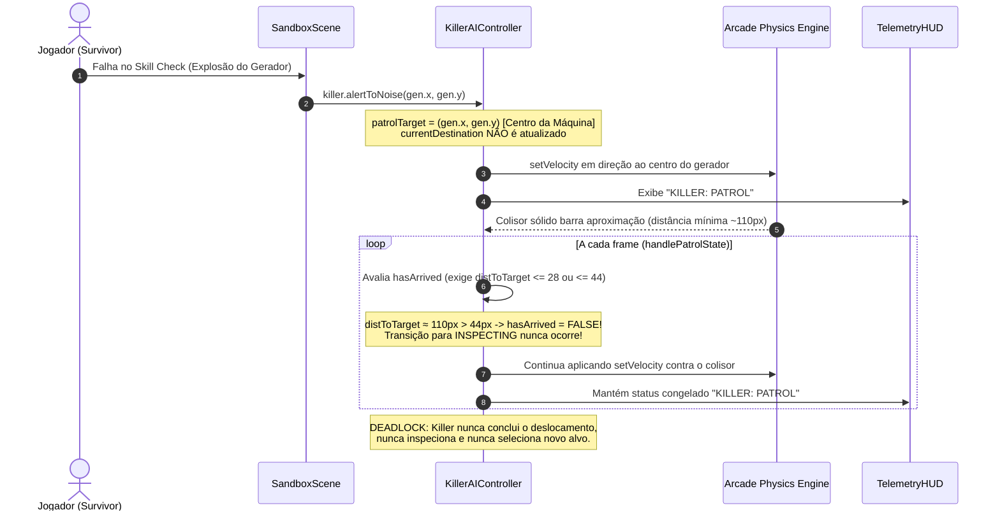

# Diagnóstico Técnico: Killer Travado em PATROL no Gerador após Explosão

**Data:** 20/09/2026  
**Status da Análise:** Concluída (Causa Raiz Identificada)  
**Escopo:** Inteligência Artificial, Máquina de Estados (FSM) e Navegação do Assassino  

---

## 1. Causa Raiz Identificada

O congelamento do Killer no estado `PATROL` após a explosão de um gerador decorre de **três falhas correlacionadas** na máquina de estados e na geometria de parada do controlador de IA:

### 1.1 Alvo de Navegação no Centro de Objeto Intransponível
- **Arquivo:** [`src/controllers/KillerAIController.ts`](file:///Users/gabri/Documents/projects/horror-topdown/src/controllers/KillerAIController.ts)
- **Função:** [`alertToNoise(x: number, y: number)`](file:///Users/gabri/Documents/projects/horror-topdown/src/controllers/KillerAIController.ts#L380-L391) (linhas 380–391)
- **Código com Defeito:**
  ```typescript
  public alertToNoise(x: number, y: number): void {
    if (this.state === 'DESATIVADO' || this.state === 'STANDBY') return;
    this.patrolManager.interruptInspection();
    this.state = 'PATROL';
    this.patrolTarget.set(x, y); // <-- [ERRO]: Define o centro exato da máquina sólida
    this.currentPath = [];
    this.currentPathIndex = 0;
    this.pawn.calculatePath(this.pawn.x, this.pawn.y, x, y, (path) => { ... });
  }
  ```
  Ao receber o sinal de ruído, `alertToNoise` define `this.patrolTarget` diretamente para as coordenadas centrais `(x, y)` do gerador, em vez de calcular um ponto de aproximação externo (*stand-off point*). Como o gerador possui um colisor físico Arcade rígido (`Generator.solidBlock` de 50x112px ou 112x50px), o Killer é fisicamente impedido de atingir esse centro.

### 1.2 Dessincronização do Gerenciador de Destino (`currentDestination`)
- **Arquivo:** [`src/controllers/KillerAIController.ts`](file:///Users/gabri/Documents/projects/horror-topdown/src/controllers/KillerAIController.ts)
- **Função:** [`alertToNoise(x: number, y: number)`](file:///Users/gabri/Documents/projects/horror-topdown/src/controllers/KillerAIController.ts#L380-L391)
- **Problema:** `this.patrolManager.currentDestination` **não é atualizado** para o gerador que sofreu a explosão. Ele mantém o destino anterior (outro gerador a centenas de pixels de distância, ou uma sala, ou `null`).

### 1.3 Condição de Chegada Matematicamente Inatingível
- **Arquivo:** [`src/controllers/KillerAIController.ts`](file:///Users/gabri/Documents/projects/horror-topdown/src/controllers/KillerAIController.ts)
- **Função:** [`handlePatrolState`](file:///Users/gabri/Documents/projects/horror-topdown/src/controllers/KillerAIController.ts#L255-L290) (linhas 261–274)
- **Código com Defeito:**
  ```typescript
  const distToTarget = Phaser.Math.Distance.Between(this.pawn.x, this.pawn.y, this.patrolTarget.x, this.patrolTarget.y);
  const isTargetingGenerator = Boolean(
    this.patrolManager.currentDestination && this.patrolManager.currentDestination.type === 'generator'
  );
  const currentDest = this.patrolManager.currentDestination;
  const distToGen = (isTargetingGenerator && currentDest)
    ? Phaser.Math.Distance.Between(this.pawn.x, this.pawn.y, currentDest.x, currentDest.y)
    : distToTarget;

  // Chegou ao ponto frontal do gerador (stand-off) ou ao centro do cômodo
  const hasArrived = isTargetingGenerator
    ? (distToTarget <= 28 || (distToGen <= 95 && distToTarget <= 44))
    : (distToTarget <= 40);
  ```
- **Incompatibilidade Física e Geométrica:**
  1. O raio físico de colisão do Killer é de aproximadamente **`84.8px`** (`hitboxRadius: 53 * playerScale: 1.25 * killerScale: 1.28`).
  2. O gerador possui semi-larguras de **`25px`** e **`56px`** em seus eixos ortogonais.
  3. No ponto de contato físico máximo (com o Killer colado na borda da máquina), a distância euclidiana entre o centro do Killer e o centro do gerador é:
     - No lado estreito: $84.8 + 25 = \mathbf{109.8px}$.
     - No lado largo: $84.8 + 56 = \mathbf{140.8px}$.
  4. Portanto, `distToTarget` **nunca** atinge valores $\le 28px$, $\le 40px$ ou $\le 44px$.
  5. Adicionalmente, `distToGen <= 95` é fisicamente impossível quando em colisão ($109.8px > 95px$). Além disso, como `currentDestination` não foi atualizado no alerta de ruído, `distToGen` aponta para o gerador anterior (frequentemente $> 1000px$).
  6. **Resultado:** `hasArrived` é avaliado como `false` em todos os frames, impedindo indefinidamente a transição para `INSPECTING`.

---

## 2. Mecânica do Congelamento (Ciclo Passo a Passo)



1. **Disparo da Falha:** O jogador erra o QTE de conserto. [`SandboxScene.ts`](file:///Users/gabri/Documents/projects/horror-topdown/src/scenes/SandboxScene.ts#L454) invoca `this.killer.alertToNoise(this.activeNearbyGen.x, this.activeNearbyGen.y)`.
2. **Atribuição do Alvo Incorreto:** [`KillerAIController.ts`](file:///Users/gabri/Documents/projects/horror-topdown/src/controllers/KillerAIController.ts#L384) interrompe qualquer inspeção prévia, define `this.state = 'PATROL'` e fixa `this.patrolTarget` nas coordenadas brutas centrais `(x, y)` do gerador.
3. **Bloqueio Físico Real:** O Killer se desloca até o gerador. Ao alcançar a carcaça da máquina, o corpo rígido Arcade (`Generator.solidBlock`) trava o deslocamento em $\approx 110px$ a $141px$ de distância do centro.
4. **Falha Persistente de Gatilho de Chegada:** Em `handlePatrolState`, todas as verificações de proximidade falham (`110 > 28`, `110 > 44`, `110 > 40`).
5. **Deadlock da FSM:** 
   - O Killer nunca executa `this.state = 'INSPECTING'`.
   - O temporizador de inspeção (`patrolManager.startInspection`) nunca inicia.
   - `advanceToNextPatrolGenerator()` nunca é chamado, pois depende da conclusão da inspeção.
   - O status `KILLER: PATROL` congela no HUD enquanto o robô empurra o gerador continuamente.

---

## 3. Comportamento da Heurística de Próximo Alvo

A investigação confirmou um efeito colateral adicional caso a chegada física fosse contornada:
- A função [`getNextDestination`](file:///Users/gabri/Documents/projects/horror-topdown/src/utils/gameLogic.ts#L1017) em `GeneratorPatrolManager` filtra o gerador anterior usando `this.lastVisitedGenerator`:
  ```typescript
  if (rawGens.length > 1 && this.lastVisitedGenerator) {
    const remaining = rawGens.filter((g) => g.name !== this.lastVisitedGenerator);
    if (remaining.length > 0) candidates = remaining;
  }
  ```
- **Problema:** Como `alertToNoise` não atribui `this.lastVisitedGenerator = alertedGen.name`, quando uma inspeção pós-ruído termina, o gerador afetado **não está na lista de exclusão**.
- Como o gerador que sofreu a explosão possui `progress > 0`, ele recebe o bônus de peso ponderado (`w += 2.0 + (g.progress / 100) * 3.0`), aumentando a probabilidade de ser re-selecionado consecutivamente em um ciclo vicioso.

---

## 4. Plano de Correção Recomendado

A correção recomendada é **cirúrgica**, não altera colisores nem parâmetros da física global e divide-se em 3 ajustes pontuais:

### Ajuste A: Suporte a Ponto de Aproximação (Stand-off) no `alertToNoise`
Em [`src/controllers/KillerAIController.ts`](file:///Users/gabri/Documents/projects/horror-topdown/src/controllers/KillerAIController.ts):
1. No método `alertToNoise(x, y, targetGen?)`:
   - Se houver um gerador nas coordenadas `(x, y)` (ou passado como parâmetro), calcular o ponto externo livre utilizando [`getGeneratorStandOffPoint`](file:///Users/gabri/Documents/projects/horror-topdown/src/utils/gameLogic.ts#L575).
   - Atualizar `this.patrolManager.currentDestination = { name: targetGen.name, x: targetGen.x, y: targetGen.y, type: 'generator' }`.
   - Atualizar `this.patrolManager.lastVisitedGenerator = targetGen.name` para garantir que o próximo sorteio de patrulha ignore este gerador recém-inspecionado.
   - Definir `this.patrolTarget.set(standOff.x, standOff.y)`.

### Ajuste B: Calibração de Raio do Stand-Off em [`gameLogic.ts`](file:///Users/gabri/Documents/projects/horror-topdown/src/utils/gameLogic.ts)
1. Na função [`getGeneratorStandOffPoint`](file:///Users/gabri/Documents/projects/horror-topdown/src/utils/gameLogic.ts#L575):
   - Atualizar a distância padrão do ponto de stand-off de `72px` para `110px` a `115px` a partir do centro (posicionado confortavelmente fora do colisor de 56px + raio do Killer de 85px, e bem dentro da zona de interação de 130px).

### Ajuste C: Tolerância de Chegada Resiliente em [`KillerAIController.ts`](file:///Users/gabri/Documents/projects/horror-topdown/src/controllers/KillerAIController.ts)
1. Na função `handlePatrolState`:
   - Reconhecer a chegada quando:
     - `distToTarget <= 32` (Killer atingiu o ponto de stand-off transitável); OU
     - `distToGen <= 130 && distToTarget <= 55` (Killer entrou na zona amarela de interação de 130px e está adjacente ao stand-off); OU
     - O Killer está dentro do raio de interação (`distToGen <= 130`) e com velocidade nula/bloqueada por colisão contínua há mais de 150ms.
   - Isso garante que qualquer contato físico próximo inicie a inspeção de 2.5s e libere a transição para a próxima ronda de patrulha.
